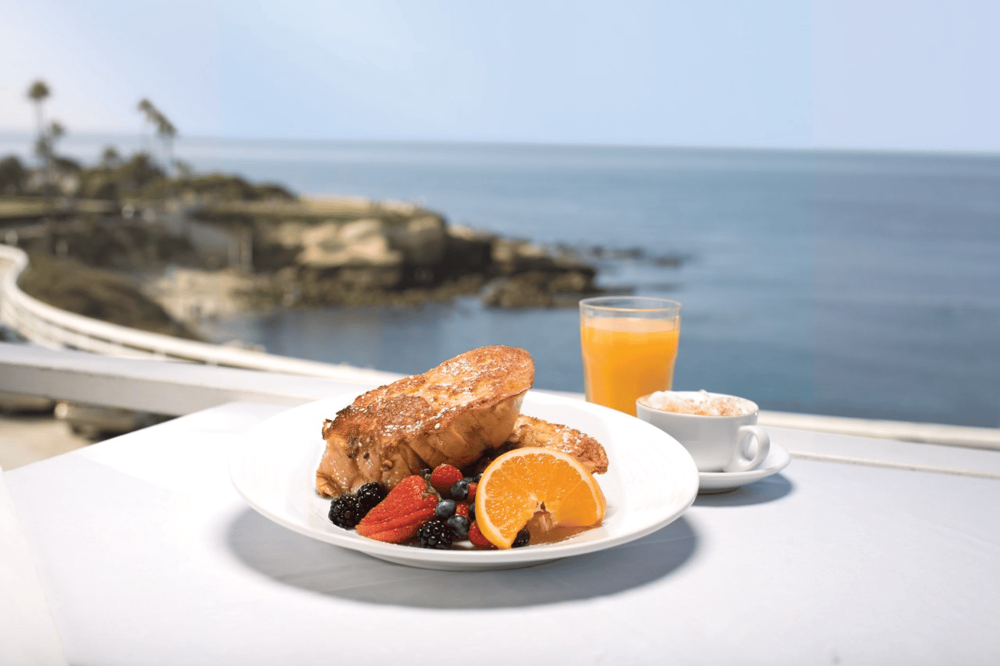
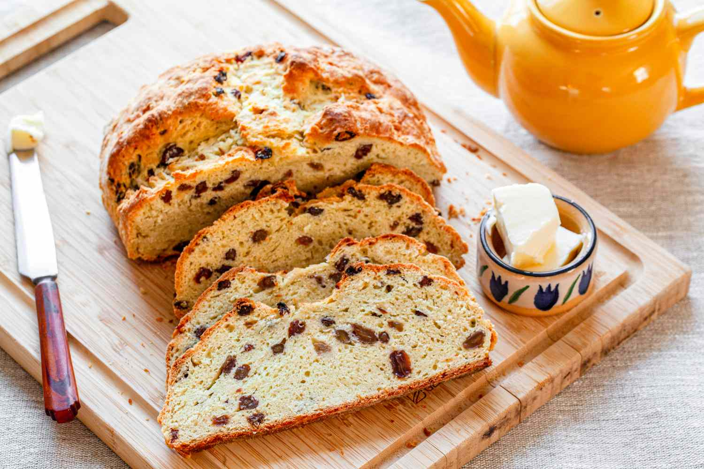

# Basic HTML Website with a few recipes
- [Project Guidelines](https://www.theodinproject.com/lessons/foundations-recipes)
- Developer: [David M O'Mullan](https://github.com/davidomullan)

***Chocolate Cookies*** 
***French Toast*** 
***Irish Soda Bread*** 